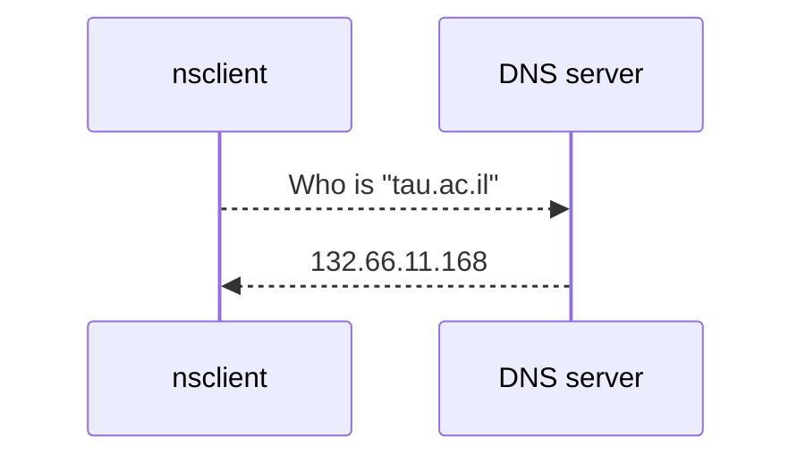

# Simple Name-server client
Developed by:
* Shachar Cohen (313416521) 
* Yuval Naor (312497084) 

This project is an implementation a simple nslookup-like tool.

This client allows to query any desired DNS server, and translate any desired domain name into it's IPv4 address.

## Credits
This project is using mainly Winsock2 library by Microsoft.
You can find in the code comments references and gratitude for personals which helped with implementing some logics.

## Running instructions:

This manual will instruct you on how to to get the client running

### nsclient.exe

Running template: 
>**nsclient.exe [DNS IP ADDRESS]**

####	**Example**:
	> nsclient.exe 8.8.8.8
	Server Ip address is valid
	
	Enter the Domain Name you wish to query: tau.ac.il
	132.66.11.168
	
When using an invalid DNS ip address, or invalid domain name - the client will alert the user.
If the Name Server could not find the specified domain, it will alert the user.

## Overall System Structure

nsclient is using UDP protocol to send packets to the DNS server.
This implementation is a simple implemetation of RFC 1035 protocol (https://www.rfc-editor.org/info/rfc1035)

 
## Restrictions
1. This client currenly supports only direct DNS requests (Domain to IP only)
2. We have implemented an infrastructure to support an answer of more than 1 IP address, but currently we are using just a single answer.

